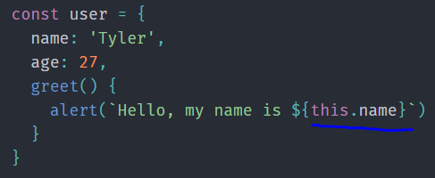
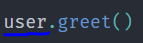
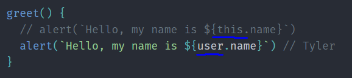
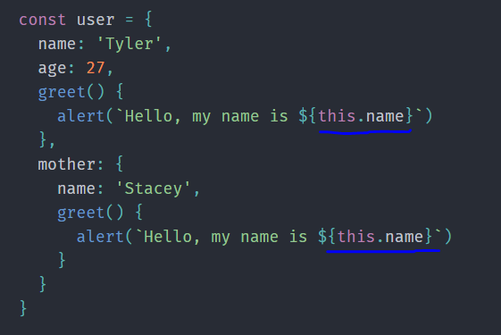
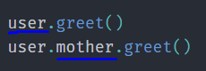
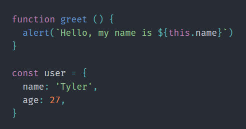
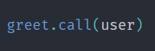
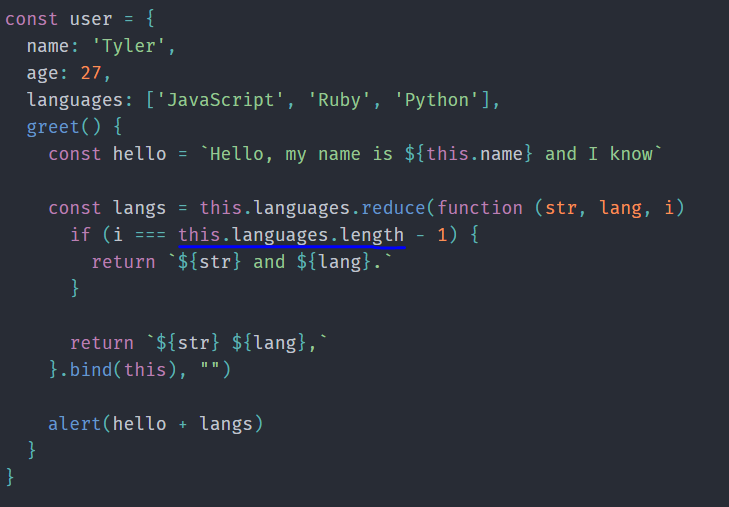
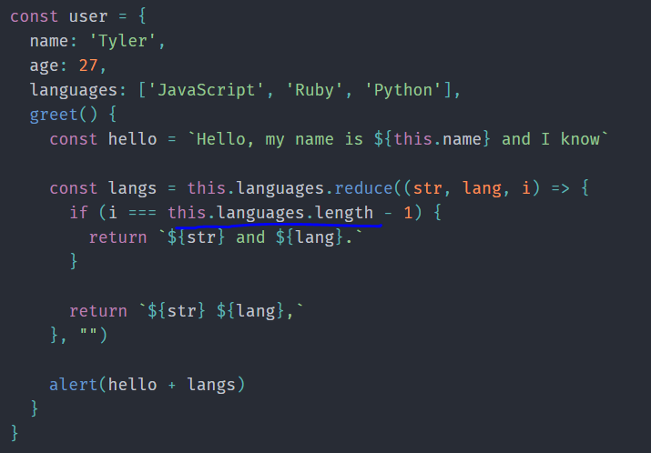
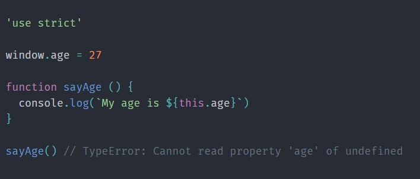

# **`this keyword`**

`Note : ` this keyword จะเป็นตัวบอกเราว่า object ไหนที่เราควรจะต้อง focus เมื่อ function หรือ method ถูกเรียก

`Note : ` จะรู้ได้ยังไงว่า this ref จากที่ไหนให้ดูว่า function ที่ใช้ this ถูกเรียกที่ไหน

มี 5 กฎในการใช้ this keyword

- Implicit Binding
- Explicit Binding
- new Binding
- Lexical Binding
- window Binding

## **`Implicit Binding`**

=> คือการ binding this keyword ที่ ref ถึง property,function ของ object







`Note : ` ให้ดูทางซ้ายของ dot เมื่อ function หรือ method ถูกเรียก (`นั่นคือ object ที่ this keyword ref ถึง`)

- จากตัวอย่างจะเห็นว่าทางซ้ายของ dot คือ object user เมื่อ greet() invoked เพราะฉะนั้น `this.name` ใน `greet()` ก็คือ `user.name` นั่นเอง
- `javascript interpreter` จะเปลี่ยน `this` ให้เป็น `user`
- `this keyword` มัน ref มาจาก `Object user`





- จากตัวอย่างข้างบนจะเห็นว่า อันแรกที่ที่อยู่ทางซ้าย dot คือ user และ อันที่ 2 ที่อยู่ทางซ้าย dot คือ mother เพราะฉะนั้น this อันแรก ref ถึง user, this อันที่ 2 ref ถึง mother

`Note : ` `Implicit Binding` คือการที่ this keyword ref ถึง object เมื่อ function หรือ method ถูกเรียก โดยมีกฎว่า `"ให้ดูทางซ้ายของ dot ที่เรียกใช้ function หรือ method นั้นๆ ก็จะรู้ว่า this ref ถึง object ตัวไหน"`

## **`Explicit Binding`**

=> คือการ binding this keyword โดยการใช้ `call()`, `apply()`, `bind()` ที่เป็นการกำหนด specific context ให้ `this keyword` ใน function สามารถ ref ถึงได้



### _`call()`_

=> เป็น property ที่ทุกๆ function มี เอาไว้กำหนด specific context ให้กับ function ที่เราใช้ เพื่อให้ this keyword ใน function สามารถ ref ถึงตัว context ที่เราส่งเข้าไป



- จากตัวอย่าง function `greet()` เรียกใช้ property `call()` โดยที่เราส่ง argument เข้าไปเป็น object `user` เพื่อให้ `this` ใน `greet()` สามารถ ref ถึง `name` ของ `user` ได้

`Note : ` `call()` parameter ตัวแรกคือ context ที่ต้องการจะให้ `this keyword` ref ถึง ส่วนตัวต่อไปจากนี้คือ parameter ที่ function ต้องการ

`Note : ` เราสามารถส่ง argument หลายๆตัวเข้าไปที่ `call()` ได้

```
function greet (l1, l2, l3) {
  alert(
    `Hello, my name is ${this.name} and I know ${l1}, ${l2}, and ${l3}`
  )
}

const user = {
  name: 'Tyler',
  age: 27,
}

const languages = ['JavaScript', 'Ruby', 'Python']

greet.call(user, languages[0], languages[1], languages[2])
```

### _`apply()`_

=> จะเหมือนกับ `call()` ทุกอย่าง แต่สามารถส่ง argument (`ที่ไม่ใช่ context`) ที่ function ต้องการเข้าไปเป็น array ได้ โดยไม่ต้องส่งไปทีละตัว มันจะ spread array ให้เอง

```
const languages = ['JavaScript', 'Ruby', 'Python']

// greet.call(user, languages[0], languages[1], languages[2])
greet.apply(user, languages)

```

### _`bind()`_

=> จะเหมือนกับ `call()` ทุกอย่าง แต่ไม่ได้ถูก invoke ทันทีเมื่อเรียกใช้ จะ return ออกมาเป็น function ที่สามารถเอาไปเรียกใช้ทีหลังได้แทน

```
function greet (l1, l2, l3) {
  alert(
    `Hello, my name is ${this.name} and I know ${l1}, ${l2}, and ${l3}`
  )
}

const user = {
  name: 'Tyler',
  age: 27,
}

const languages = ['JavaScript', 'Ruby', 'Python']

const newFn = greet.bind(user, languages[0], languages[1], languages[2])
newFn() // alerts "Hello, my name is Tyler and I know JavaScript, Ruby, and Python"
```

## **`new Binding`**

=> เมื่อเราสร้าง function ผ่าน new instance ตัว this keyword จะ ref ถึง new instance แต่ละตัวที่สร้างขึ้นมาใหม่ของใครของมันเลย

```
function User (name, age) {
  this.name = name;
  this.age = age;
}

const me = new User('Tyler', 27);
me.name; // Tyler
me.age; // 27
```

## **`Lexical Binding`**



- จากตัวอย่างด้านบนมันจะ error ถ้าเราไม่ใช้ `bind()` เพราะว่า `this.languages` ใน function reduce มัน undefined เนื่องจาก function (`this.languages`) มันไม่ได้ถูก invoke แต่มันถูกส่งเข้าไปใน reduce ทำให้ `this keyword` ไม่สามารถ ref ถึง เพราะไม่รู้ว่าต้อง ref ถึงใคร เราเลยใช้ bind(this) เพื่อให้มัน ref ถึง ซึ่ง this ในที่นี้คือ user นั่นเอง
- เราสามารถใช้ arrow function จัดการเพื่อทำให้ code กระชับและเขียนง่ายขึ้นได้ และไม่จำเป็นต้องใช้ `bind()`



`Note : ` ใน arrow function ไม่มี this เป็นของตัวเอง ทำให้ javascript interpreter มันจะมองหา enclosing scope(parent) ที่ this keyword จะสามารถ ref ถึงได้แทน

`Note : ` Lexical Binding ใช้ arrow function จัดการจะง่ายกว่า

## **`window Binding`**

```
function sayAge () {
  console.log(`My age is ${this.age}`)
}

const user = {
  name: 'Tyler',
  age: 27
}

sayAge() // undefined
```

- จากตัวอย่างด้านบน this.age จะ undefined เพราะว่าไม่มีอะไรให้ this keyword ref ถึง (ไม่มีการเรียกใช้แบบ implicit binding, explicit binding, new binding)
- ซึ่งโดย default this keyword จะ ref ถึง window object
- ที่ window object ไม่มี property age และการเรียกใช้ function sayAge() ก็ไม่ได้ใช้กฎ this binding ข้อไหนเลยทำให้ มัน error ไม่สามารถ ref ถึงได้ จึงแก้ด้วยการกำหนด property age ให้กับ window object

```
window.age = 27

function sayAge () {
  console.log(`My age is ${this.age}`)
}
```

`Note : ` ถ้าการใช้ this binding ไม่ได้ใช้กฎข้อไหนเลย this keyword จะ ref ถึง window object เป็น default



`Note : ` ใน strict mode default this ของ window object จะ undefined เสมอ (`Javascript ES5`)

## `Summary this binding`

1. มองหาที่ๆ function invoked
2. มี object อยู่ทางซ้ายของ dot มั้ย (`implicit binding`)? ถ้ามี object นั้นแหละที่ this ref ถีง ถ้าไม่มีไปข้อ 3
3. มีการเรียกใช้ `call()`, `apply()`, `bind()` มั้ย (`explicit binding`)? ถ้ามี this ref ถึงตัว context ตัวแรกที่โยนเข้ามาใน parameter ถ้าไม่มีไปข้อ 4
4. มีการสร้าง function ผ่าน new instance (`new binding`) มั้ย? ถ้ามี this จะ ref ถึง new instance ใหม่ของแต่ละตัวที่สร้างขึ้นมา ถ้าไม่มีไปข้อ 5
5. มี this ใน arrow function (`lexical binding`) มั้ย? ถ้ามี this จะ ref ถึงใน enclosing scope (parent) ถ้าไม่มีไปข้อ 6
6. มีการใช้ strict mode มั้ย ? ถ้ามี this จะ undefined เสมอ ถ้าไม่มีไปข้อ 7
7. default this จะ ref ถึง window object

### `Referrence`

- https://ui.dev/this-keyword-call-apply-bind-javascript/
